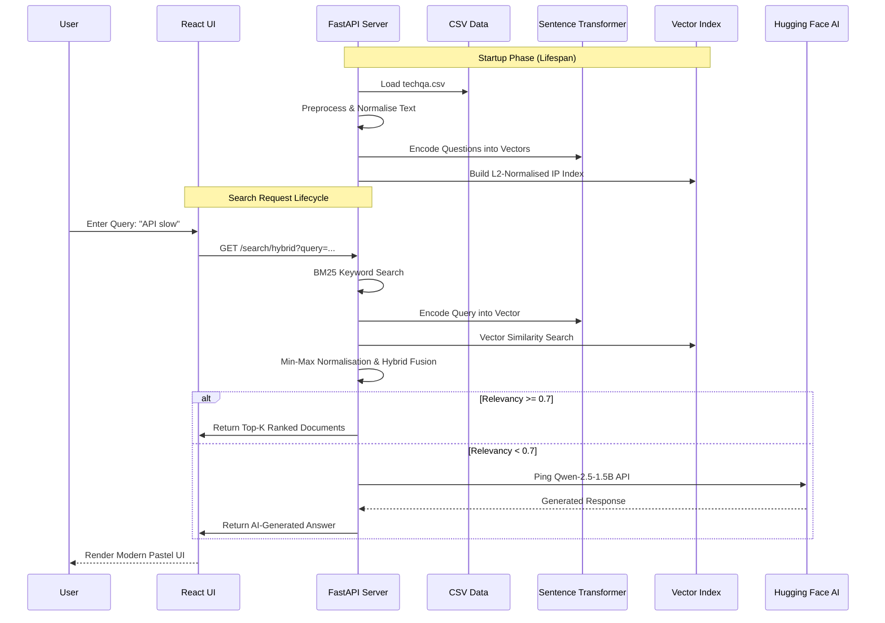

# Technical Whitepaper: Neural Search Engine for Technical Q&A 🧠🔍

This document provides an exhaustive, low-level breakdown of the architecture, algorithmic design, and engineering decisions behind the **Semantic & Hybrid Search Engine**.

---

## 1. High-Level Architecture & Lifecycle

The application follows a decoupled client-server model. The backend is a "Stateful" API that builds its indices in-memory at startup to ensure sub-millisecond search latencies.

### System Flow Diagram


---

## 2. Data Engineering & Preprocessing

The system utilizes the `TechQA` dataset. Raw data undergoes a strictly-ordered pipeline before it is presented to the engines:

1.  **Cleaning**: COLLAPSE multiple whitespaces into a single space using Regex (`\s+`).
2.  **Filtering**: Rows with empty questions, empty answers, or placeholder values (like `"-"`) are pruned to ensure high-quality retrieval.
3.  **Dual-Stream Indexing**:
    - **Stream A (BM25)**: Text is Lowercased for case-insensitive keyword overlap calculation.
    - **Stream B (Semantic)**: Original text is preserved for the transformer model, as casing can sometimes carry semantic value (e.g., proper nouns/APIs).

---

## 3. Algorithmic Deep Dive: Hybrid Retrieval

The "secret sauce" of this project is how it merges traditional search with AI meaning.

### A. BM25 (Rank-BM25)
Standard probabilistic ranking. Good for exact matches of error codes. It produces scores where higher is better, but the range is arbitrary (e.g., 0 to 45).

### B. Semantic (Sentence Transformers + FAISS)
We use the `all-MiniLM-L6-v2` model.
- **Model Efficiency**: This model is optimized for CPU/GPU balance, converting text into **384-dimensional dense vectors**.
- **Vector Space**: We use **L2-Normalization** on all document and query vectors.
- **FAISS Engine**: We use `IndexFlatIP` (Inner Product). Because our vectors are L2-normalized, the Inner Product is mathematically identical to **Cosine Similarity** ($0.0$ to $1.0$).

### C. The Fusion Formula (Min-Max Normalisation)
Since BM25 and Semantic scores have different scales, we cannot simply add them. We first normalise both sets to a common $[0, 1]$ range:

$$Score_{norm} = \frac{v - min(v_{batch})}{max(v_{batch}) - min(v_{batch})}$$

Then, we apply the **Linear Fusion**:
$$HybridScore = \alpha \cdot SemanticScore_{norm} + (1 - \alpha) \cdot BM25Score_{norm}$$

---

## 4. API Endpoint Documentation

The backend serves the following RESTful endpoints:

| Endpoint | Method | Parameters | Response Object |
| :--- | :--- | :--- | :--- |
| `/search/hybrid` | GET | `query`, `top_k`, `alpha` | `SearchResponse` |
| `/search/compare` | GET | `query`, `top_k` | `CompareResponse` |
| `/health` | GET | None | `HealthResponse` |

### JSON Response Schema Example
```json
{
  "query": "How to scale Postgres?",
  "method": "hybrid",
  "results": [
    {
      "rank": 1,
      "question": "Scaling strategies for SQL databases",
      "answer": "Vertical vs Horizontal scaling...",
      "score": 0.8234,
      "source": "retrieval"
    }
  ],
  "time_ms": 42.1
}
```

---

## 5. Deployment & Security

### Security (Secrets Management)
The application handles sensitive API keys (Hugging Face) using a **`.env`** file.
```env
HF_API_TOKEN=hf_*************************
```
This file is excluded from version control to prevent leaks while `python-dotenv` ensures the server can access it at runtime.

### Scalability
- **Engine Initialization**: Done once at startup (Lifespan). Searches are then pure mathematical lookups on pre-built indices.
- **CORS Configuration**: The server is locked to specific `CORS_ORIGINS` (Port 5173 for local dev) to prevent Cross-Site scripting attacks.

---

## 7. Example Case: Tracing a Query

To understand the system in practice, let's trace a sample query: **"System crashing due to high heap usage"**

### A. The Conflict (Semantic vs. Keyword)
- **BM25 Engine**: Looks for the exact words "system", "crashing", "heap".
    - *Doc A (Keyword Match)*: "System requirements for Heap-based Sorting." (Score: **High**)
- **Semantic Engine**: Understands that "crashing" and "high heap" usually mean **OutOfMemoryErrors**.
    - *Doc B (Semantic Match)*: "Resolving Java OutOfMemoryError: Java heap space." (Score: **High**)

### B. The Hybrid Resolution
The Hybrid Engine applies the $0.5$ weight to both. 
- **Doc A** is downranked because although it has the word "Heap", the *meaning* (Sorting algorithms) is irrelevant to "crashing".
- **Doc B** is upranked because even though it doesn't contain the word "crashing", the *meaning* is a direct resolution to the user's problem.
- **Winner**: Doc B is returned as Rank #1.

### C. The Fallback Scenario
Now, imagine the user asks: **"What is the best way to travel from London to Paris?"**
1.  **Search**: The engines check the Technical Q&A database. No match is found.
2.  **Scoring**: The top hybrid score is **0.25** (Below our **0.7** threshold).
3.  **Trigger**: The `llm_client` kicks in.
4.  **Generative AI**: Qwen-2.5 responds with: *"The fastest way to travel from London to Paris is via the Eurostar train, taking approximately 2 hours and 16 minutes..."*
5.  **Output**: The user gets a helpful answer instead of an empty search screen!


1.  **Intent over Keywords**: Finds answers when the user uses the "wrong" words but has the "right" intent.
2.  **Zero-Result Avoidance**: The LLM fallback ensures the user ALWAYS leaves with some utility, even if the local database is empty.
3.  **Scientific Evaluation**: The comparison metrics (Precision@K) help software engineers tune their search parameters based on real performance data.
